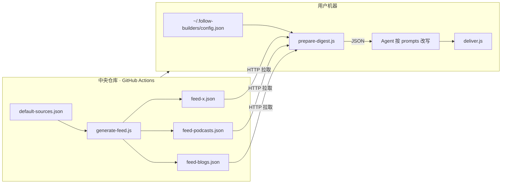

[English](README.md) | **中文**

# 追踪建造者，而非网红

Follow Builders 是一个面向 **Cursor / Claude Code / OpenClaw / Codex** 等 AI Agent 的 **Agent Skill**——不是普通 npm 包。它追踪 AI 领域真正在做事的人（研究员、创始人、PM、工程师），把他们的 X 动态、播客与官方博客整理成可读摘要，并按需或定时推送到你指定的渠道。

**理念：** 追踪那些真正在做产品、有独立见解的 **建造者（Builders）**，而非只会搬运信息的 **网红（Influencers）**。

---

## 目录

- [你会得到什么](#你会得到什么)
- [快速开始](#快速开始)
- [安装](#安装)
- [修改设置](#修改设置)
- [自定义摘要风格](#自定义摘要风格)
- [默认信息源](#默认信息源)
- [Skill 说明](#skill-说明)
  - [核心理念](#核心理念)
  - [整体架构](#整体架构)
  - [SKILL.md 在指挥什么](#skillmd-在指挥什么)
  - [仓库目录职责](#仓库目录职责)
  - [触发方式](#触发方式)
  - [README 与 SKILL.md 的关系](#readme-与-skillmd-的关系)
  - [设计亮点](#设计亮点)
- [Cursor / Codex 使用](#cursor--codex-使用)
- [隐私](#隐私)
- [许可证](#许可证)

---

## 你会得到什么

每日或每周推送到你常用的通讯工具（Telegram、Discord、WhatsApp 等），包含：

- 顶级 AI 播客新节目的精华摘要
- 26 位精选 AI 建造者在 X/Twitter 上的关键观点和洞察
- AI 公司官方博客的完整文章（Anthropic Engineering、Claude Blog）
- 所有原始内容的链接
- 支持英文、中文或双语版本

> **用户侧一般不需要 X / YouTube API Key。** 公开内容在 GitHub 上由 CI 每日更新为 `feed-*.json`，你的 Agent 只需拉取 JSON 即可。

查看 [examples/sample-digest.md](examples/sample-digest.md) 了解输出示例。

---

## 快速开始

1. 在你的 AI Agent 中安装此 Skill（OpenClaw、Claude Code 或 Cursor）
2. 输入 `set up follow builders`，或执行 `/follow-builders`、`/ai`
3. Agent 会以对话方式引导你完成设置——无需手动编辑配置文件

Agent 会询问你：

- 推送频率（每日或每周）和时间
- 语言偏好（英文 / 中文 / 双语）
- 推送方式（Telegram、邮件，或直接在聊天中显示）

不需要任何内容抓取 API key——所有内容由中心化服务统一抓取。设置完成后，第一期摘要会立即生成。

---

## 安装

### OpenClaw

```bash
# 从 ClawhHub 安装（即将上线）
clawhub install follow-builders

# 或手动安装
git clone https://github.com/FlyAIBox/follow-builders.git ~/skills/follow-builders
cd ~/skills/follow-builders/scripts && npm install
```

### Claude Code

```bash
git clone https://github.com/FlyAIBox/follow-builders.git ~/.claude/skills/follow-builders
cd ~/.claude/skills/follow-builders/scripts && npm install
```

### Cursor / Codex

```bash
mkdir -p ~/.codex/skills
git clone https://github.com/FlyAIBox/follow-builders.git ~/.codex/skills/follow-builders
cd ~/.codex/skills/follow-builders/scripts && npm install
```

### 系统要求

- 一个 AI Agent（OpenClaw、Claude Code、Cursor、Codex 或类似工具）
- 网络连接（用于获取中心化 feed）

仅此而已。内容抓取不需要用户侧 API key；若使用 Telegram / 邮件推送，仅需在本地配置对应的投递密钥。

---

## 修改设置

通过对话即可修改推送偏好。直接告诉你的 Agent：

- 「改成每周一早上推送」
- 「语言换成中文」
- 「把摘要写得更简短一些」
- 「显示我当前的设置」

信息源列表（建造者和播客）由中心化统一管理和更新——你无需做任何操作即可获得最新源。


| 可改项           | 方式                                                                                         |
| ------------- | ------------------------------------------------------------------------------------------ |
| 频率、时区、语言、投递方式 | 对话修改 `~/.follow-builders/config.json`，并更新 cron                                             |
| 摘要风格          | 对话修改 prompt，或复制到 `~/.follow-builders/prompts/` 后编辑                                         |
| 信息源列表         | **不可**自行增删；可到 [GitHub Issues](https://github.com/zarazhangrui/follow-builders/issues) 提出建议 |


---

## 自定义摘要风格

Skill 使用纯文本 prompt 文件控制摘要方式。你可以：

**通过对话（推荐）：** 直接告诉 Agent——「摘要写得更简练」「多关注可操作的洞察」「用更轻松的语气」。Agent 会自动更新 prompt。

**直接编辑（高级用户）：** 编辑 `prompts/` 文件夹中的文件：


| 文件                     | 作用               |
| ---------------------- | ---------------- |
| `summarize-podcast.md` | 播客节目摘要方式         |
| `summarize-tweets.md`  | X/Twitter 帖子摘要方式 |
| `summarize-blogs.md`   | 博客文章摘要方式         |
| `digest-intro.md`      | 整体摘要格式与语气        |
| `translate.md`         | 英文翻译为中文的方式       |


这些都是纯文本指令，不是代码。修改后下次推送即生效。若要持久化自定义且不被中央更新覆盖，请复制到 `~/.follow-builders/prompts/` 再编辑。

---

## 默认信息源

### 播客（6 个）

- [Latent Space](https://www.youtube.com/@LatentSpacePod)
- [Training Data](https://www.youtube.com/playlist?list=PLOhHNjZItNnMm5tdW61JpnyxeYH5NDDx8)
- [No Priors](https://www.youtube.com/@NoPriorsPodcast)
- [Unsupervised Learning](https://www.youtube.com/@RedpointAI)
- [The MAD Podcast with Matt Turck](https://www.youtube.com/@DataDrivenNYC)
- [AI & I by Every](https://www.youtube.com/playlist?list=PLuMcoKK9mKgHtW_o9h5sGO2vXrffKHwJL)

### X 上的 AI 建造者（26 位）

[Andrej Karpathy](https://x.com/karpathy), [Swyx](https://x.com/swyx), [Josh Woodward](https://x.com/joshwoodward), [Boris Cherny](https://x.com/bcherny), [Thibault Sottiaux](https://x.com/thsottiaux), [Peter Yang](https://x.com/petergyang), [Nan Yu](https://x.com/thenanyu), [Madhu Guru](https://x.com/realmadhuguru), [Amanda Askell](https://x.com/AmandaAskell), [Cat Wu](https://x.com/_catwu), [Thariq](https://x.com/trq212), [Google Labs](https://x.com/GoogleLabs), [Amjad Masad](https://x.com/amasad), [Guillermo Rauch](https://x.com/rauchg), [Alex Albert](https://x.com/alexalbert__), [Aaron Levie](https://x.com/levie), [Ryo Lu](https://x.com/ryolu_), [Garry Tan](https://x.com/garrytan), [Matt Turck](https://x.com/mattturck), [Zara Zhang](https://x.com/zarazhangrui), [Nikunj Kothari](https://x.com/nikunj), [Peter Steinberger](https://x.com/steipete), [Dan Shipper](https://x.com/danshipper), [Aditya Agarwal](https://x.com/adityaag), [Sam Altman](https://x.com/sama), [Claude](https://x.com/claudeai)

### 官方博客（2 个）

- [Anthropic Engineering](https://www.anthropic.com/engineering) — Anthropic 团队的技术深度文章
- [Claude Blog](https://claude.com/blog) — Claude 的产品公告与更新

---

## Skill 说明

Follow Builders 把「跟踪 AI 行业真正在做事的人」拆成三层：

1. **数据集中抓取** — GitHub Actions 每日生成 `feed-*.json`
2. **Agent 按提示词二次创作** — LLM 读取 JSON，按 `prompts/` 写成摘要
3. **定时 / 按需投递** — OpenClaw cron、Telegram / 邮件，或对话内 `/ai`

### 核心理念


| 概念                  | 含义                            |
| ------------------- | ----------------------------- |
| **Follow Builders** | 跟踪研究者、创始人、PM、工程师等「在造东西的人」     |
| **Not Influencers** | 不跟只会转述信息的 KOL                 |
| **Philosophy**      | 内容来自 X、播客、官方博客；由 Agent 写成可读摘要 |


### 整体架构




**中央侧**（`.github/workflows/generate-feed.yml`）：每天 UTC 6:17 用 `X_BEARER_TOKEN`、`POD2TXT_API_KEY` 等密钥运行 `generate-feed.js`，抓取推文、播客文稿、博客，写入 `feed-*.json` 并 push。

**用户侧：**


| 组件                  | 职责                                                           |
| ------------------- | ------------------------------------------------------------ |
| `prepare-digest.js` | 一次 HTTP 拉取三个 feed + 远程 prompts + 本地 `config.json`，输出一个大 JSON |
| Agent               | 只负责按 `prompts/`* 把 JSON 原文 remix 成日报；**禁止**自己上网、编造、猜职位       |
| `deliver.js`        | Telegram / Resend 邮件，或 stdout 直接在对话输出                        |


**五层分工（更细）：**

1. **信息源注册表** — `config/default-sources.json` 定义播客、官方博客、X 账号及 `focus` 信号类型
2. **中心 feed 生成层** — `generate-feed.js` 抓取、去重（`state-feed.json`）、写入三个 feed 文件
3. **用户侧输入打包层** — `prepare-digest.js` 合并 feed、prompts、用户配置，输出 LLM 输入 JSON
4. **LLM 混编层** — Agent 排序、分组、摘要、翻译，聚焦 AI / Agent / GPU / 推理基础设施信号
5. **交付层** — `deliver.js` 或 OpenClaw channel 系统完成推送

> 脚本负责确定性的抓取、规范化、去重和交付；LLM 只负责编辑判断与表达。API key、定时任务、去重状态与推送逻辑均与 prompt 层隔离。

### SKILL.md 在指挥什么

`SKILL.md` 是给 LLM 的**操作手册**（SOP），分三大块：

#### 1. 平台检测与首次引导（Onboarding）

- 用 `which openclaw` 区分 **OpenClaw**（常驻、多通道）与 **Cursor / Claude Code**（非常驻）
- 配置写入 `~/.follow-builders/config.json`：`frequency`、`timezone`、`language`、`delivery` 等
- 非 OpenClaw 若要不关终端也能收摘要，需配 **Telegram Bot** 或 **Resend 邮件**；否则只能按需输入 `/ai`
- OpenClaw 用 `openclaw cron add`，且必须指定 `--channel` 和 `--to`（**不能**用 `--channel last`）
- 引导结束必须**立刻跑一遍完整 digest** 作为欢迎样本

#### 2. 内容交付流程（每次 `/ai` 或 cron）


| 步骤  | 执行者                 | 动作                                                                           |
| --- | ------------------- | ---------------------------------------------------------------------------- |
| 1   | Agent               | 读取 `config.json`                                                             |
| 2   | `prepare-digest.js` | 拉 feed + prompts，stdout 输出 JSON                                              |
| 3   | Agent               | 若 `stats` 全为 0 → 告知无更新并停止                                                    |
| 4   | Agent               | 按 `summarize_tweets` / `summarize_podcast` / `digest_intro` 改写；**每条必须有 URL** |
| 5   | Agent               | 按 `en` / `zh` / `bilingual` 输出（双语须**段落交错**，不能先英后中）                           |
| 6   | `deliver.js` 或直接输出  | 按 `delivery.method` 发送                                                       |


**硬性规则（防幻觉）：**

- 只用 JSON 里的内容；用 `bio` 定身份，不瞎猜 title
- 不访问 x.com、不搜索、不调 API
- 没有 URL 的内容不得收录

#### 3. 运行时改设置

- **信息源** — 不可用户自行修改，仅可通过 Issue 建议
- **调度** — 频率、时区、语言、投递方式 → 改 `config.json` 并更新 cron
- **摘要风格** — 复制 prompt 到 `~/.follow-builders/prompts/` 再改，避免被中央更新覆盖

### 仓库目录职责


| 路径                            | 作用                                                                    |
| ----------------------------- | --------------------------------------------------------------------- |
| `SKILL.md`                    | Agent 完整 SOP（安装目录下的同名文件，如 `~/.codex/skills/follow-builders/SKILL.md`） |
| `config/default-sources.json` | 26 个 X 账号、6 个播客、2 个博客的权威列表                                            |
| `config/config-schema.json`   | 用户配置字段说明（实际配置在 `~/.follow-builders/config.json`）                      |
| `prompts/*.md`                | 纯自然语言：怎么写摘要、排版、翻译                                                     |
| `scripts/prepare-digest.js`   | 确定性数据准备，减轻 Agent 负担                                                   |
| `scripts/deliver.js`          | Telegram / 邮件投递                                                       |
| `scripts/generate-feed.js`    | CI 专用，需要 API 密钥                                                       |
| `feed-*.json`                 | 已处理好的公开内容快照（生成产物，勿手改）                                                 |
| `examples/sample-digest.md`   | 期望输出样例                                                                |


### 触发方式


| 方式             | 示例                                                                                         |
| -------------- | ------------------------------------------------------------------------------------------ |
| 自然语言           | 「set up follow builders」、要 AI 行业 digest、行业洞察                                               |
| 显式命令           | `/ai`、`/follow-builders`                                                                   |
| 定时（OpenClaw）   | `openclaw cron add`，完整走 prepare → LLM remix → deliver                                      |
| 定时（系统 crontab） | `prepare-digest.js | deliver.js` — **注意：不经过 LLM remix**，只投递原始 JSON；完整摘要请用 `/ai` 或 OpenClaw |


### README 与 SKILL.md 的关系


| 文档              | 读者    | 内容                            |
| --------------- | ----- | ----------------------------- |
| **README**（本文件） | 人     | 项目说明、安装、架构、隐私、源列表             |
| **SKILL.md**    | Agent | 逐步剧本：检测平台、引导用户、跑脚本、禁止行为、改配置话术 |


你 clone 的是 **follow-builders 源码仓库**；实际使用时 Skill 常被安装到 `~/.claude/skills/follow-builders` 或 `~/.codex/skills/follow-builders`，Agent 读取的是安装目录下的 `SKILL.md`，逻辑与仓库一致。

### 设计亮点

- **职责分离** — 需密钥的抓取在 GitHub Actions；用户只需 fetch 公开 JSON
- **Prompt 即配置** — 非程序员也能用对话改 `summarize-tweets.md` 等
- **多平台适配** — OpenClaw 自动通道 vs Cursor 按需 `/ai` + 可选 Telegram
- **防编造** — 数据与创作边界清晰；Skill 中以 ABSOLUTE RULES 约束模型

---

## Cursor / Codex 使用

安装完成后，在 Cursor 或 Codex 中直接请求：

- `/ai`
- `使用 follow-builders 准备今天的 AI 建造者摘要`
- `用 follow-builders 汇总最新 Agent 和 GPU 基础设施信号`
- `把 follow-builders 优化成更关注 Agent、GPU、推理基础设施和产品发布`

**按需模式：** Agent 运行 `scripts/prepare-digest.js` → 读取 JSON → 结合 prompt 生成摘要 → 在对话中展示。

**定时模式：** 配置 `~/.follow-builders/config.json`，再用 OpenClaw cron、系统 cron 或外部调度器串起 `prepare → summarize → deliver` 流程。

若要提升 AI / Agent / GPU 热点聚合质量，请分开调整：

- **信息源** — `config/default-sources.json`（维护者侧）
- **摘要口径** — `prompts/summarize-*.md` 或 `~/.follow-builders/prompts/`
- **feed 文件** — 生成产物，除调试外不建议手动修改

---

## 隐私

- 不发送任何内容抓取 API key——所有内容由中心化服务获取
- 若使用 Telegram / 邮件推送，相关 key 仅存储在本地 `~/.follow-builders/.env`
- Skill 只读取公开内容（公开博客、YouTube 视频、X 帖子）
- 你的配置、偏好和阅读记录都保留在你自己的设备上

---

## 许可证

MIT